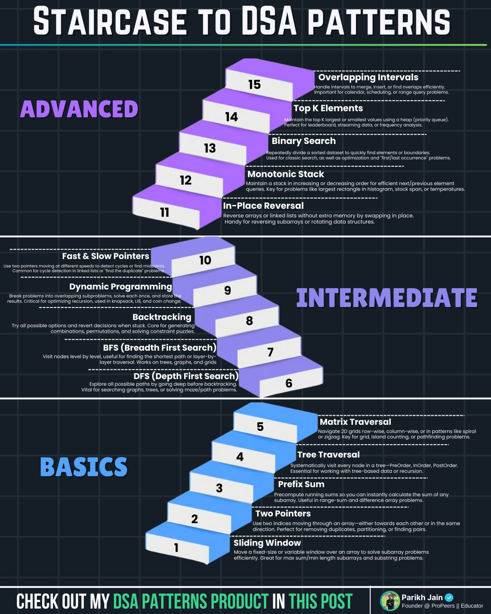

- 

- Patterns:
    - Patterns: https://www.linkedin.com/posts/shauryaprataps_frequency-of-the-most-frequent-element-activity-7364151817045233664-pSbl/?utm_source=share&utm_medium=member_android&rcm=ACoAAB78IuoBYm2bVXH7whQTlWTl9E-1oiDmwiQ
    - Patterns: https://www.linkedin.com/posts/shauryaprataps_frequency-of-the-most-frequent-element-activity-7364151817045233664-pSbl/?utm_source=share&utm_medium=member_android&rcm=ACoAAB78IuoBYm2bVXH7whQTlWTl9E-1oiDmwiQ
    - Patterns: https://www.linkedin.com/posts/tannika-majumder-424a5040_i-didnt-solve-1000-problems-to-crack-my-activity-7363562062704226305-GcA8/?utm_source=share&utm_medium=member_android&rcm=ACoAAB78IuoBYm2bVXH7whQTlWTl9E-1oiDmwiQ
    - Patterns: https://www.linkedin.com/posts/kartikey-kumar-srivastava-3969b8aa_in-2020-i-cracked-amazon-as-an-sde-in-2022-activity-7363427009919676416-sgaW/?utm_source=share&utm_medium=member_android&rcm=ACoAAB78IuoBYm2bVXH7whQTlWTl9E-1oiDmwiQ
    - Patterns: https://www.linkedin.com/posts/parikh-jain-79568798_learn-5-patterns-youll-be-ready-for-500-activity-7382272405492203520-3X1X/?utm_source=share&utm_medium=member_android&rcm=ACoAAB78IuoBYm2bVXH7whQTlWTl9E-1oiDmwiQ
    - Patterns: https://www.linkedin.com/posts/brianwoolfrey_softwareengineering-codinginterviews-programming-activity-7373781474791067648-3nr7/?utm_source=share&utm_medium=member_android&rcm=ACoAAB78IuoBYm2bVXH7whQTlWTl9E-1oiDmwiQ
    - Patterns: https://www.linkedin.com/posts/sanchitnarula_solving-these-14-groups-of-60-dsa-problems-activity-7381186848112459776-Kcy_/?utm_source=share&utm_medium=member_android&rcm=ACoAAB78IuoBYm2bVXH7whQTlWTl9E-1oiDmwiQ
    - Patterns: https://www.linkedin.com/posts/kartikey-kumar-srivastava-3969b8aa_if-i-had-1-month-left-for-the-interview-and-activity-7375385803385942017-q3Wv/?utm_source=share&utm_medium=member_android&rcm=ACoAAB78IuoBYm2bVXH7whQTlWTl9E-1oiDmwiQ
    - Patterns: https://www.linkedin.com/posts/brianwoolfrey_if-you-interview-at-amazon-you-will-100-activity-7373752506520190976-85Hn/?utm_source=share&utm_medium=member_android&rcm=ACoAAB78IuoBYm2bVXH7whQTlWTl9E-1oiDmwiQ
    - Patterns: https://www.linkedin.com/posts/parikh-jain-79568798_a-mentee-of-mine-just-cracked-his-swe-internship-activity-7377936640889106432-W4-G/?utm_source=share&utm_medium=member_desktop&rcm=ACoAAB78IuoBYm2bVXH7whQTlWTl9E-1oiDmwiQ
    - Patterns: https://www.linkedin.com/posts/parikh-jain-79568798_your-friend-is-solving-1-medium-1-hard-activity-7380476163997147136-h-Fm/?utm_source=share&utm_medium=member_desktop&rcm=ACoAAB78IuoBYm2bVXH7whQTlWTl9E-1oiDmwiQ
    - Patterns: https://www.linkedin.com/posts/sai-ram-somanaboina_if-i-were-learning-recursion-again-in-2025-activity-7380228774933557248-xChr/?utm_source=share&utm_medium=member_android&rcm=ACoAAB78IuoBYm2bVXH7whQTlWTl9E-1oiDmwiQ
    - Patterns: https://www.linkedin.com/posts/sai-ram-somanaboina_there-are-over-3500-questions-on-leetcode-activity-7379138393030635520-uQlo/?utm_source=share&utm_medium=member_android&rcm=ACoAAB78IuoBYm2bVXH7whQTlWTl9E-1oiDmwiQ
    - Patterns: https://www.linkedin.com/posts/parikh-jain-79568798_20-dsa-problem-solving-patterns-that-cover-activity-7387339548474859521-Vh8R/?utm_source=share&utm_medium=member_android&rcm=ACoAAB78IuoBYm2bVXH7whQTlWTl9E-1oiDmwiQ
    - Patterns: https://www.linkedin.com/posts/kartikey-kumar-srivastava-3969b8aa_during-my-meta-dsa-rounds-i-used-arrays-activity-7388084468001062913-hNEC/?utm_source=share&utm_medium=member_android&rcm=ACoAAB78IuoBYm2bVXH7whQTlWTl9E-1oiDmwiQ
    - Patterns: https://www.linkedin.com/posts/kartikey-kumar-srivastava-3969b8aa_if-youre-right-now-sitting-for-placements-activity-7388794189842452480-z4fO/?utm_source=share&utm_medium=member_android&rcm=ACoAAB78IuoBYm2bVXH7whQTlWTl9E-1oiDmwiQ
    - Patterns: https://www.linkedin.com/posts/parikh-jain-79568798_20-dsa-problem-solving-patterns-that-cover-activity-7389527537560797184-PAot/?utm_source=share&utm_medium=member_android&rcm=ACoAAB78IuoBYm2bVXH7whQTlWTl9E-1oiDmwiQ
    - Patterns: https://www.linkedin.com/posts/parikh-jain-79568798_my-20-dsa-patterns-cheatsheet-that-has-helped-activity-7385171740852690944-Kat7/?utm_source=share&utm_medium=member_android&rcm=ACoAAB78IuoBYm2bVXH7whQTlWTl9E-1oiDmwiQ
    - Patterns: https://www.linkedin.com/posts/sai-ram-somanaboina_80-of-machine-coding-rounds-are-based-on-activity-7382038403305029633-Kuxa/?utm_source=share&utm_medium=member_android&rcm=ACoAAB78IuoBYm2bVXH7whQTlWTl9E-1oiDmwiQ
    - Patterns: https://www.linkedin.com/posts/anshisinha09_dsa-codinginterview-careergoals-activity-7382769436019212288-gB3O/?utm_source=share&utm_medium=member_android&rcm=ACoAAB78IuoBYm2bVXH7whQTlWTl9E-1oiDmwiQ
    - Patterns with resource list: https://www.linkedin.com/posts/shreya-narayan-1536271a4_dsa-systemdesign-codingresources-activity-7383348662636212224-viYP/?utm_source=share&utm_medium=member_android&rcm=ACoAAB78IuoBYm2bVXH7whQTlWTl9E-1oiDmwiQ
    - Patterns: https://www.linkedin.com/posts/kartikey-kumar-srivastava-3969b8aa_solve-these-12-groups-of-55-graph-problems-activity-7371035107744219136-ebFz/?utm_source=share&utm_medium=member_android&rcm=ACoAAB78IuoBYm2bVXH7whQTlWTl9E-1oiDmwiQ

- CPP
    - thread creation in CPP cost: https://www.linkedin.com/posts/vijaykpanchal_cplusplus-threading-performanceoptimization-activity-7382995968780091392-R4lr/?utm_source=share&utm_medium=member_android&rcm=ACoAAB78IuoBYm2bVXH7whQTlWTl9E-1oiDmwiQ
    - CPP memory management: https://www.linkedin.com/posts/eduardogomezsaldias_include-packt-memory-activity-7381599345156206592-JQXH/?utm_source=share&utm_medium=member_android&rcm=ACoAAB78IuoBYm2bVXH7whQTlWTl9E-1oiDmwiQ

- General preperation advise: https://www.linkedin.com/posts/rahul-cse_repost-comment-activity-7373558771442180096-kRyk/?utm_source=share&utm_medium=member_android&rcm=ACoAAB78IuoBYm2bVXH7whQTlWTl9E-1oiDmwiQ

- System design
    - System design: load balancing algos: https://www.linkedin.com/posts/arslanahmad_loadbalancer-systemdesign-systemarchitecture-activity-7362102117001515008-laxe/?utm_source=share&utm_medium=member_android&rcm=ACoAAB78IuoBYm2bVXH7whQTlWTl9E-1oiDmwiQ
    - System design interview Microsoft: https://www.linkedin.com/posts/sameer-bhardwaj1298_youre-in-a-system-design-interview-at-microsoft-activity-7382739246794784768-_O2j/?utm_source=share&utm_medium=member_android&rcm=ACoAAB78IuoBYm2bVXH7whQTlWTl9E-1oiDmwiQ
    - System design: https://www.linkedin.com/posts/deepakkasera_%F0%9D%90%87%F0%9D%90%9E%F0%9D%90%AB%F0%9D%90%9E%F0%9D%90%AC-%F0%9D%90%AD%F0%9D%90%A1%F0%9D%90%9E-%F0%9D%90%AD%F0%9D%90%AB%F0%9D%90%AE%F0%9D%90%AD%F0%9D%90%A1-%F0%9D%90%9C%F0%9D%90%AB%F0%9D%90%9A%F0%9D%90%9C%F0%9D%90%A4%F0%9D%90%A2%F0%9D%90%A7%F0%9D%90%A0-activity-7381306191005659136-NRQn/?utm_source=share&utm_medium=member_android&rcm=ACoAAB78IuoBYm2bVXH7whQTlWTl9E-1oiDmwiQ
    - System design: https://www.linkedin.com/posts/shauryaprataps_when-i-started-my-journey-at-amazon-cracking-activity-7378765525968945152-zj4l/?utm_source=share&utm_medium=member_android&rcm=ACoAAB78IuoBYm2bVXH7whQTlWTl9E-1oiDmwiQ
    - System design: https://www.linkedin.com/posts/shauryaprataps_if-you-want-to-master-system-design-in-under-activity-7384290538595921921--drU/?utm_source=share&utm_medium=member_android&rcm=ACoAAB78IuoBYm2bVXH7whQTlWTl9E-1oiDmwiQ
    - System design: https://www.linkedin.com/posts/kartikey-kumar-srivastava-3969b8aa_if-you-want-to-become-a-better-software-engineer-activity-7383358406029402112-vOXg/?utm_source=share&utm_medium=member_android&rcm=ACoAAB78IuoBYm2bVXH7whQTlWTl9E-1oiDmwiQ
    - System design: https://www.linkedin.com/posts/kartikey-kumar-srivastava-3969b8aa_jr-engineer-when-asked-how-would-you-design-activity-7383720735678087168-J8bp/?utm_source=share&utm_medium=member_android&rcm=ACoAAB78IuoBYm2bVXH7whQTlWTl9E-1oiDmwiQ

- Getting IV calls
    - How to get more IV calls: https://www.linkedin.com/posts/zhengyudian_resume-jobsearch-interviewtips-activity-7379926970442326016-MicQ/?utm_source=share&utm_medium=member_android&rcm=ACoAAB78IuoBYm2bVXH7whQTlWTl9E-1oiDmwiQ
    - How to get FAANG IV calls: https://www.linkedin.com/posts/thesuperrecruiter_if-you-want-to-land-interviews-at-apple-activity-7382437541322559488-yC0e/?utm_source=share&utm_medium=member_android&rcm=ACoAAB78IuoBYm2bVXH7whQTlWTl9E-1oiDmwiQ

- What to do in IV
    - What to do in interview: https://www.linkedin.com/posts/thesuperrecruiter_if-you-want-to-land-interviews-at-apple-activity-7382437541322559488-yC0e/?utm_source=share&utm_medium=member_android&rcm=ACoAAB78IuoBYm2bVXH7whQTlWTl9E-1oiDmwiQ
    - What to do in Google interview: https://www.linkedin.com/posts/puneet-patwari_when-i-interviewed-at-google-this-year-the-activity-7381908848908910592-005r/?utm_source=share&utm_medium=member_android&rcm=ACoAAB78IuoBYm2bVXH7whQTlWTl9E-1oiDmwiQ

- Behavioral round strategy ( targeted for Amazon ): https://www.linkedin.com/posts/shaki1506_if-your-dream-is-to-land-a-job-at-amazon-activity-7382400666301915136-zziw/?utm_source=share&utm_medium=member_android&rcm=ACoAAB78IuoBYm2bVXH7whQTlWTl9E-1oiDmwiQ

- Google IV experience:
    - Google silicon engineer inetrview experience: https://www.google.com/search?q=google-silicon-engineer-interview-process+medium&rlz=1C1VDKB_enIN1037IN1038&oq=google-silicon-engineer-interview-process+medium&gs_lcrp=EgZjaHJvbWUyBggAEEUYOTIKCAEQABiABBiiBDIKCAIQABiABBiiBDIKCAMQABiABBiiBDIKCAQQABiABBiiBDIKCAUQABiABBiiBNIBCDMwOTVqMGo0qAIAsAIA&sourceid=chrome&ie=UTF-8
    - Google interview exeperience: https://medium.com/@flick_23/cracking-the-google-sde-2-l3-interview-my-experience-4f9305a245b8
    - Google interview exeperience: https://medium.com/@santhoshimurthy00/google-interview-experience-3c75667887bd

- Techniques to enhance Linkedin profile: https://www.linkedin.com/posts/shauryaprataps_jobsearch-linkedintips-careergrowth-activity-7381677667777118208-4ok9/?utm_source=share&utm_medium=member_android&rcm=ACoAAB78IuoBYm2bVXH7whQTlWTl9E-1oiDmwiQ

- Google PM interview preparation guide: https://www.linkedin.com/posts/ai-from-aakash_1759893849637-ugcPost-7381927173323956225-w017/?utm_source=share&utm_medium=member_android&rcm=ACoAAB78IuoBYm2bVXH7whQTlWTl9E-1oiDmwiQ